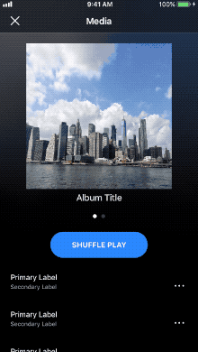
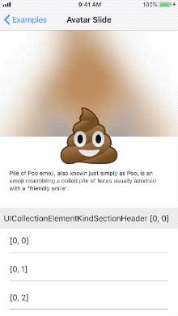
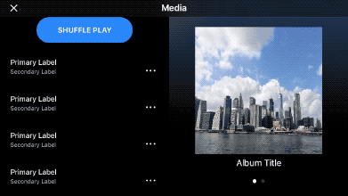
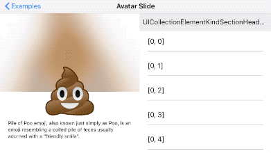

# StickySplitCollectionViewFlowLayout

### What is this?
`StickySplitCollectionViewFlowLayout` is a layout derived from `UICollectionViewFlowLayout`. It features a split layout for compact sizes as well as a sticky header cell. It supports all the same features of `UICollectionViewFlowLayout`, including `UICollectionElementKindSectionHeader` and `UICollectionElementKindSectionFooter`. The initial implementation was inspired by [CSStickyHeaderFlowLayout](https://github.com/CSStickyHeaderFlowLayout/CSStickyHeaderFlowLayout).

  




### Installing:
To install via [CocoaPods](https://cocoapods.org/) add the following to your `Podfile`:
```
pod 'StickySplitCollectionViewFlowLayout'
```

To install via [Carthage](https://github.com/Carthage/Carthage) add the following to your `Cartfile`:
```
git "https://github.com/gjeck/StickySplitCollectionViewFlowLayout.swift.git"
```

### Usage:
`StickySplitCollectionViewFlowLayout` operates very similarly to `UICollectionViewFlowLayout`. Begin by assigning a `StickySplitCollectionViewFlowLayout` to a collection view layout.
```
let stickySplitLayout = StickySplitCollectionViewFlowLayout()
collectionView.collectionViewLayout = stickySplitLayout
```

Then register a supplementary view of kind `StickySplitCollectionViewFlowLayout.mainElementKind` to be used as the main-header.
```
let nib = UINib(nibName: "SomeCollectionReusableView", bundle: nil)
collectionView.register(nib, forSupplementaryViewOfKind: StickySplitCollectionViewFlowLayout.mainElementKind, withReuseIdentifier: "someIdentifier")
```

Finally, provide a reference size for the supplementary view
```
stickySplitLayout.mainHeaderReferenceSize = CGSize(kSomeWidth, kSomeHeight)
```

#### Configuring the Layout:
The property `enforcedLayoutMode` controls the layout behavior of the main-header. It defaults to `.implicit(.left)`, meaning the main-header will align to the left when the collectionView bounds has greater width than height. This property can be set to `vertical` to behave like a regular flow layout. 

The property `mainHeaderPinsToVisibleBounds` is similar to `sectionHeadersPinToVisibleBounds`, but specified for the main-header.

Familiarize yourself with the API to see additional features!

### Contributing:
The workspace file `StickySplitCollectionViewFlowLayout.xcworkspace` is where development generally takes place. This workspace contains two projects `StickySplitCollectionViewFlowLayout` and `StickySplitCollectionViewFlowLayoutIntegration`. The project `StickySplitCollectionViewFlowLayout` is the actual exported package. The project `StickySplitCollectionViewFlowLayoutIntegration` is the integration test suite, and also serves as a display of implementation examples.

##### Unit tests and integration tests:
Unit tests are found in the `StickySplitCollectionViewFlowLayout` project. They are just `XCTest` based.

Integration tests are found in `StickySplitCollectionViewFlowLayoutIntegration` and are often [FBSnapshotTestCase](https://github.com/uber/ios-snapshot-test-case) based.

##### Versioning:
The project follows the conventions outlined in [semantic versioning](http://semver.org/). To update the version:
```
git tag -a MAJOR.MINOR.PATCH -m "version MAJOR.MINOR.PATCH"
git push origin --tags
```
Also, be sure to update the version specified in `StickySplitCollectionViewFlowLayout.podspec`.

##### CocoaPods:
To verify the podspec is working correctly run the following:
```
pod spec lint
```
